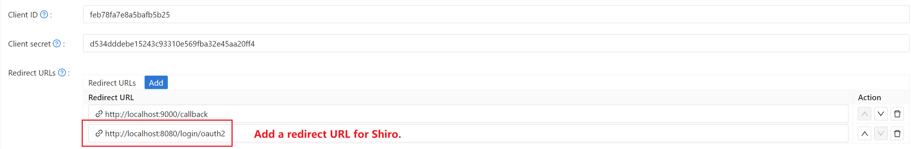
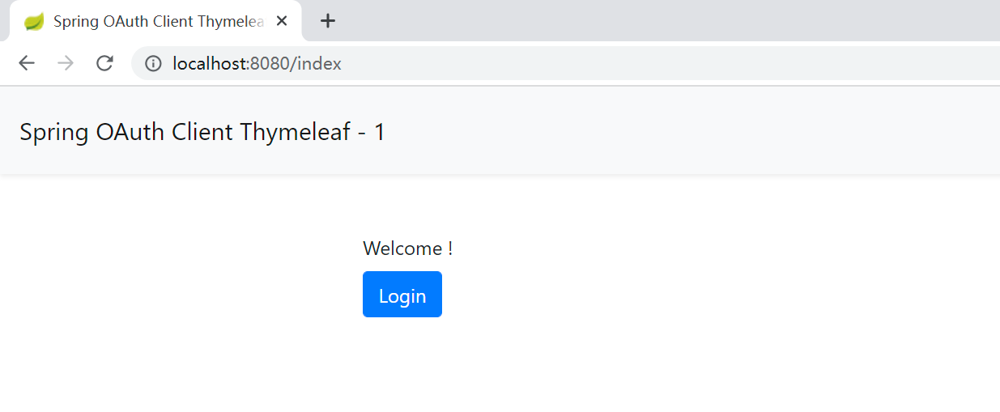
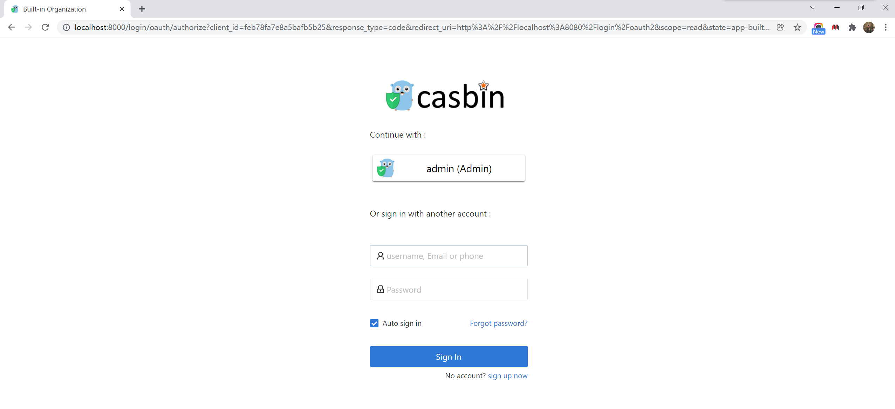
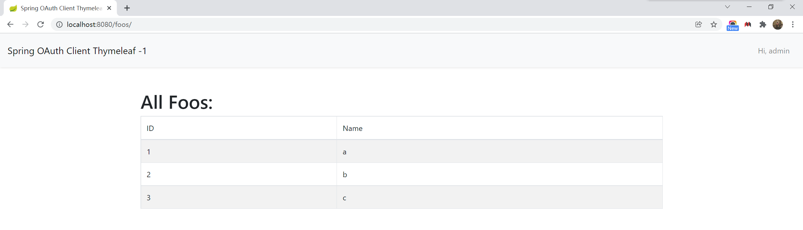

# Shiro

Casdoor can use OIDC protocol as IDP to connect various applications. Here we will use Shiro as an example to show you how to use OIDC to connect to your applications. And the official [shiro-casdoor](https://github.com/casdoor/shiro-casdoor) middleware makes the integration of Shiro and Casdoor easier.

## Step1. Deploy Casdoor

Firstly, the Casdoor should be deployed.

You can refer to the Casdoor official documentation for the [Server Installation](https://casdoor.com/docs/basic/server-installation).

After a successful deployment, you need to ensure:

- The Casdoor server is successfully running on **http://localhost:8000**.
- Open your favorite browser and visit **http://localhost:7001**, you will see the login page of Casdoor.
- Input `admin` and `123` to test login functionality is working fine.

Then you can quickly implement a Casdoor based login page in your own app with the following steps.

## Step2. Configure Casdoor application

1. Create or use an existing Casdoor application.
2. Add Your redirect url



3. Add provider you want and supplement other settings.

Not surprisingly, you can get two values on the application settings page: `Client ID` and `Client secret` like the picture above, we will use them in next step.

Open your favorite browser and visit: **http://CASDOOR_HOSTNAME/.well-known/openid-configuration**, you will see the OIDC configure of Casdoor.

## Step3. Configure Shiro

Shiro doesn't support OIDC natively. But you can use [casdoor-spring-boot-starter](https://github.com/casdoor/casdoor-spring-boot-starter) to communicate with Casdoor.

```yml
shiro:
  web:
    enabled: true
  loginUrl: /login
casdoor:
  endpoint: http://localhost:8000
  client-id: <Client ID>
  client-secret: <Client Secret>
  jwt-public-key: <JWT Public Key>
  organization-name: built-in
  application-name: <Application Name>
```

## Step4. Get Started with A Demo

1. We can create a Spring Boot application.
2. We can add a configuration which protects all endpoints except `/login`, `/login/oauth2` and `/index` for users to log in.

```java
@Bean
public ShiroFilterChainDefinition shiroFilterChainDefinition() {
    DefaultShiroFilterChainDefinition chainDefinition = new DefaultShiroFilterChainDefinition();
    chainDefinition.addPathDefinition("/login", "anon");
    chainDefinition.addPathDefinition("/login/oauth2", "anon");
    chainDefinition.addPathDefinition("/index", "anon");
    // all other paths require a logged in user
    chainDefinition.addPathDefinition("/**", "authc");
    return chainDefinition;
}
```

3. Init the shiro-casdoor middleware and config `DefaultWebSecurityManager` as below.

```java
@Resource
private CasdoorConfig casdoorConfig;

@Bean
CasdoorShiroRealm simpleAccountRealm() {
    return new CasdoorShiroRealm(
        casdoorConfig.getEndpoint(),
        casdoorConfig.getClientId(),
        casdoorConfig.getClientSecret(),
        casdoorConfig.getJwtPublicKey(),
        casdoorConfig.getOrganizationName(),
        casdoorConfig.getApplicationName()
    );
}

@Bean
public DefaultWebSecurityManager securityManager(CasdoorShiroRealm accountRealm) {
    DefaultWebSecurityManager securityManager = new DefaultWebSecurityManager();
    securityManager.setRealm(accountRealm);
    return securityManager;
}
```

4. Next, we can add two APIs for authentication.

```java
@RequestMapping("/login")
public String login() throws UnsupportedEncodingException {
    return "redirect:" + casdoorAuthService.getSigninUrl("http://localhost:8080/login/oauth2");
}

@RequestMapping("/login/oauth2")
public String doLogin(String code, String state) throws OAuthProblemException, OAuthSystemException {
    String token = casdoorAuthService.getOAuthToken(code, state);
    BearerToken bearerToken = new BearerToken(token);
    SecurityUtils.getSubject().login(bearerToken);
    return "redirect:http://localhost:8080/foos";
}
```

5. We can add a naive page for user to log in.

```html
<!DOCTYPE html>
<html lang="en">
<head>
    <meta http-equiv="Content-Type" content="text/html; charset=utf-8"/>
    <title>Spring OAuth Client Thymeleaf - 1</title>
    <link rel="stylesheet"
          href="https://stackpath.bootstrapcdn.com/bootstrap/4.1.3/css/bootstrap.min.css"/>
</head>
<body>
<nav class="navbar navbar-expand-lg navbar-light bg-light shadow-sm p-3 mb-5">
    <a class="navbar-brand" th:href="@{/foos/}">Spring OAuth Client Thymeleaf - 1</a>
</nav>
<div class="container">
    <label>Welcome ! </label> <br/> <a th:href="@{/foos/}"
                                       class="btn btn-primary">Login</a>
</div>
</body>
</html>
```

When user clicks the `login` button, he will be redirected to Casdoor.

6. Next, we can define our protected resource. We can export an endpoint called `/foos` and a web page for display.

Data Model

```java
public class FooModel {
    private Long id;
    private String name;

    public FooModel(Long id, String name) {
        super();
        this.id = id;
        this.name = name;
    }
    public Long getId() {
        return id;
    }
    public void setId(Long id) {
        this.id = id;
    }
    public String getName() {
        return name;
    }
    public void setName(String name) {
        this.name = name;
    }
}
```

Controller

```java
@GetMapping("/foos")
public String getFoos(Model model) {
    List<FooModel> foos = new ArrayList<>();
    foos.add(new FooModel(1L, "a"));
    foos.add(new FooModel(2L, "b"));
    foos.add(new FooModel(3L, "c"));
    model.addAttribute("foos", foos);
    return "foos";
}
```

Web page

```html
<!DOCTYPE html>
<html lang="en" xmlns:sec="http://www.w3.org/1999/xhtml">
<head>
    <meta http-equiv="Content-Type" content="text/html; charset=utf-8"/>
    <title>Spring OAuth Client Thymeleaf - 1</title>
    <link rel="stylesheet"
          href="https://stackpath.bootstrapcdn.com/bootstrap/4.1.3/css/bootstrap.min.css"/>
</head>
<body>
<nav
        class="navbar navbar-expand-lg navbar-light bg-light shadow-sm p-3 mb-5">
    <a class="navbar-brand" th:href="@{/foos/}">Spring OAuth Client
        Thymeleaf -1</a>
    <ul class="navbar-nav ml-auto">
        <li class="navbar-text">Hi, <span th:text="${session.name}"></span>&nbsp;&nbsp;&nbsp;
        </li>
    </ul>
</nav>
<div class="container">
    <h1>All Foos:</h1>
    <table class="table table-bordered table-striped">
        <thead>
        <tr>
            <td>ID</td>
            <td>Name</td>
        </tr>
        </thead>
        <tbody>
        <tr th:if="${foos.empty}">
            <td colspan="4">No foos</td>
        </tr>
        <tr th:each="foo : ${foos}">
            <td><span th:text="${foo.id}"> ID </span></td>
            <td><span th:text="${foo.name}"> Name </span></td>
        </tr>
        </tbody>
    </table>
</div>
</body>
</html>
```

## Step5. Try the demo!

Firstly, you can try to open your favorite browser and directly visit `/foos`. It will automatically redirect to Casdoor's login page. You can log in here or from the root page.

If you visit your index page,



Click the `login` button and the page will redirect to Casdoor's login page.



After you log in, the page will redirect to `/foos`.

