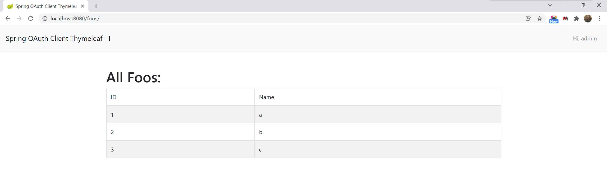
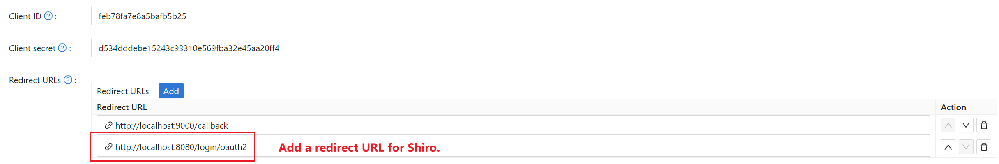

# Casdoor Spring Boot Shiro Example

[](https://github.com/casdoor/casdoor-spring-boot-shiro-example/actions/workflows/build.yml)
[](https://github.com/casdoor/casdoor-spring-boot-shiro-example/blob/master/LICENSE)
[](https://discord.gg/5rPsrAzK7S)

An example [Apache Shiro](https://shiro.apache.org/) app on Spring Boot 3 that signs users in with [Casdoor](https://casdoor.ai/), using [casdoor-spring-boot-starter](https://github.com/casdoor/casdoor-spring-boot-starter).

| Page                 | Shiro filter | Description                                              |
|----------------------|--------------|----------------------------------------------------------|
| `/`                  | `anon`       | Welcome page with a **Login with Casdoor** button        |
| `/login`             | `anon`       | Redirects to the Casdoor sign-in page                    |
| `/login/oauth2`      | `anon`       | Casdoor redirects back here with `code` and `state`      |
| `/foos`              | `authc`      | Protected page, shows some data and the signed-in user   |
| `/logout` (POST)     | `authc`      | Signs out of the app and ends the Casdoor session        |



## How it works

1. Opening `/foos` without signing in: the `authc` filter sends the user to `shiro.loginUrl`, i.e. `/login`.
2. `/login` keeps a random `state` in the session and redirects to the Casdoor sign-in page (`AuthService.getSigninUrl()`).
3. Casdoor redirects back to `/login/oauth2?code=...&state=...`. The controller checks the state, exchanges the code for an access token (`AuthService.getOAuthToken()`) and signs in to Shiro with it: `subject.login(new BearerToken(token))`.
4. [CasdoorShiroRealm](src/main/java/com/casbin/shiro/example/config/CasdoorShiroRealm.java) verifies the token, a JWT, with the certificate of the application (`AuthService.parseJwtToken()`). The principal is the Casdoor `User`, and its Casdoor roles become Shiro roles, so `subject.hasRole("...")` and `@RequiresRoles` work.
5. `POST /logout` calls Casdoor's logout API with the access token (`AuthService.logoutCurrentSession()`) and `subject.logout()`.

`AuthService` comes from casdoor-spring-boot-starter, configured by the `casdoor.*` properties.

## Prerequisites

- Java 17+
- Maven 3.9+ (or `./mvnw`)
- A Casdoor server. The example is preconfigured for the public demo server https://door.casdoor.com, so it runs as is. To use your own, see [Casdoor installation](https://casdoor.ai/docs/basic/server-installation).

## Configuration

Skip this section to try the example with the public demo server.

In your Casdoor, create (or reuse) an organization and an application, and add `http://localhost:8080/login/oauth2` to the application's **Redirect URLs**:



Then fill in [application.yml](src/main/resources/application.yml):

```yaml
shiro:
  web:
    enabled: true
  loginUrl: /login

casdoor:
  endpoint: https://door.casdoor.com          # Casdoor server URL
  client-id: 294b09fbc17f95daf2fe             # client ID of the application
  client-secret: dd8982f7046ccba1bbd7851d5c1ece4e52bf039d  # client secret of the application
  certificate: |                              # the certificate of the cert used by the application, see Casdoor -> Certs
    -----BEGIN CERTIFICATE-----
    ...
    -----END CERTIFICATE-----
  organization-name: casbin                   # organization of the application
  application-name: app-vue-python-example    # name of the application
  redirect-url: http://localhost:8080/login/oauth2
```

Shiro 2 runs on Spring Boot 3 (Jakarta EE) through the `jakarta` classifier of `shiro-spring-boot-starter`, `shiro-spring` and `shiro-web`, see [pom.xml](pom.xml).

## Run

```shell
git clone https://github.com/casdoor/casdoor-spring-boot-shiro-example
cd casdoor-spring-boot-shiro-example
mvn spring-boot:run
```

Open http://localhost:8080 and click **Login with Casdoor**. On the demo server, sign in with username `admin` and password `123`.

Run the tests:

```shell
mvn verify
```

## Resources

- [Casdoor documentation](https://casdoor.ai/docs/overview)
- [casdoor-spring-boot-starter](https://github.com/casdoor/casdoor-spring-boot-starter)
- [Apache Shiro with Spring Boot](https://shiro.apache.org/spring-boot.html)

## License

[Apache-2.0](LICENSE)
